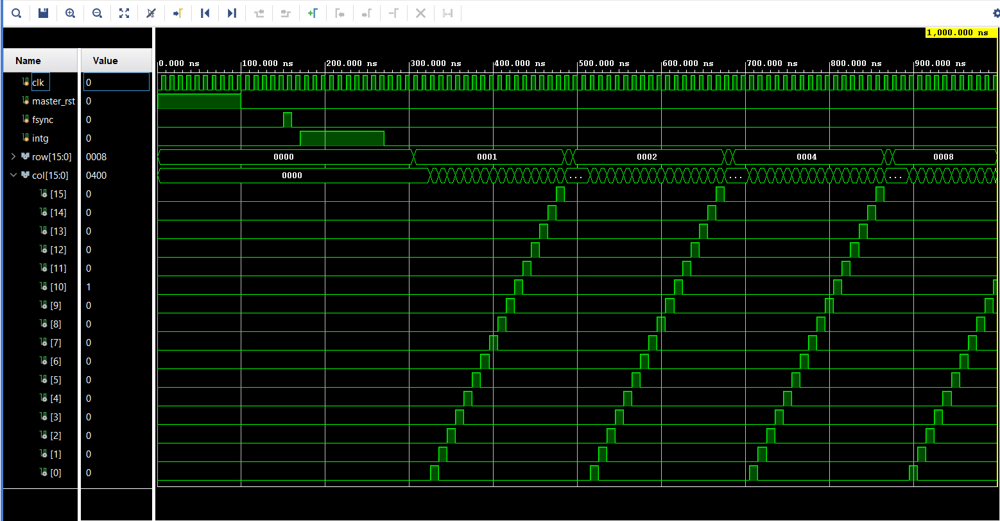

# Digital Block Design of ROIC (Read-Out Integrated Circuit) | Verilog HDL

This repository contains the Verilog HDL implementation and documentation for the digital block of a Read-Out Integrated Circuit (ROIC), completed during my internship at **Solid State Physics Laboratory (SSPL), DRDO** under the mentorship of **Scientist E – Navneet Kaur Saini** .

---

## 📌 Project Overview

The digital block of an ROIC is responsible for scanning pixel data from a sensor array in a precise and sequential manner.  
This design includes a **Finite State Machine (FSM)** that acts as a pixel scanner, implemented using Verilog HDL and verified through simulations in **Xilinx Vivado**.

---

## 🧠 Key Features

- ✅ FSM-based pixel scanning logic
- ✅ Synthesizable Verilog HDL
- ✅ Tested on Vivado Simulator
- ✅ Modular & scalable pixel scanning approach
- ✅ Detailed report documenting design logic, FSM state transitions, and simulation

---

## 🖼 Simulation Output

> Add waveform screenshots under `/sim/waveform_screenshots/`  
> Example:

---

## 🧪 How to Simulate (Vivado)

1. Open **Xilinx Vivado**
2. Create a new project and add files from `src/` and `testbench/`
3. Set `pixel_scanner_v3_tb.v` as the top module
4. Run Behavioral Simulation
5. Analyze waveform output using built-in waveform viewer

---

## 📄 Documentation

A complete internship report is included under [`docs/ROIC_Internship_Report.pdf`](docs/ROIC_Internship_Report.pdf), covering:
- ROIC architecture and application
- FSM design for pixel scanning
- Verilog code breakdown
- Simulation results and analysis
- Tools used: Xilinx Vivado.

---

## 👨‍💻 Author

**Shivam Mandal**  
Digital Electronics Engineering Student  
Intern at DRDO – SSPL, New Delhi  
Mentor: Scientist E – Navneet Kaur Saini

---

## 📜 License

This project is licensed under the [MIT License](LICENSE).

---

## 🌐 Acknowledgments

- **Solid State Physics Laboratory (SSPL), DRDO**
- **Jadavpur University**

